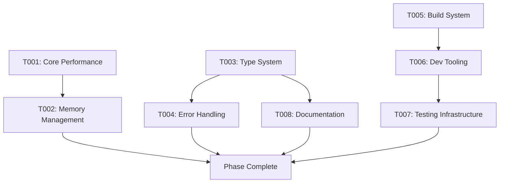

# Phase 001: Foundation & Core Architecture
**Duration**: 2-3 Weeks
**Priority**: Critical
**Status**: Planning

## Phase Overview
Establish the technical foundation and core architecture improvements for Kairos. This phase focuses on optimizing the existing codebase, implementing performance improvements, and preparing the platform for scaling.

---

## Task List

### T001: Core Performance Optimization
- **Title**: Core Date Operations Performance Enhancement
- **Description**: Optimize core date manipulation operations for better performance, particularly focusing on frequently used methods like add(), subtract(), format(), and comparison operations.
- **Details**:
  - Profile current performance bottlenecks in core operations
  - Implement caching strategies for expensive calculations
  - Optimize algorithms for date arithmetic
  - Add performance benchmarks and regression tests
- **Files**:
  - `src/core/plugin-system.ts` (main optimization)
  - `tests/performance/benchmark.test.ts` (enhanced benchmarks)
  - `src/core/utils/cache.ts` (improved caching)
- **Dependencies**: None
- **Estimated Hours**: 24
- **Status**: Pending

### T002: Memory Management Enhancement
- **Title**: Advanced Memory Management & Cache Optimization
- **Description**: Implement sophisticated memory management strategies to reduce memory footprint and prevent memory leaks, especially for large-scale operations.
- **Details**:
  - Implement object pooling for frequently created objects
  - Optimize LRU cache sizes and invalidation strategies
  - Add memory usage monitoring and alerts
  - Implement lazy loading for less-used plugins
- **Files**:
  - `src/core/utils/cache.ts` (enhanced caching system)
  - `src/core/plugin-system.ts` (memory optimization)
  - `tools/memory-analyzer.js` (new tool)
  - `tests/performance/memory.test.ts` (memory tests)
- **Dependencies**: T001
- **Estimated Hours**: 20
- **Status**: Pending

### T003: Type System Enhancement
- **Title**: Advanced TypeScript Type System Improvements
- **Description**: Enhance TypeScript type definitions for better developer experience, stronger type safety, and improved IDE support.
- **Details**:
  - Implement branded types for date objects
  - Add template literal types for format strings
  - Create utility types for common operations
  - Improve error type definitions
- **Files**:
  - `src/core/types/` (all type files)
  - `src/core/types/brands.ts` (new branded types)
  - `src/core/types/format.ts` (format string types)
  - `tests/unit/types/` (type validation tests)
- **Dependencies**: None
- **Estimated Hours**: 16
- **Status**: Pending

### T004: Error Handling System
- **Title**: Comprehensive Error Handling & Validation System
- **Description**: Implement a robust error handling system with detailed error messages, error codes, and recovery mechanisms.
- **Details**:
  - Create custom error classes for different error types
  - Implement error codes and internationalized messages
  - Add error recovery mechanisms
  - Create error reporting and analytics
- **Files**:
  - `src/core/errors/` (new error system directory)
  - `src/core/errors/base-error.ts` (base error class)
  - `src/core/errors/validation-error.ts` (validation errors)
  - `src/core/utils/error-handler.ts` (error handling utilities)
  - `tests/unit/errors/` (error handling tests)
- **Dependencies**: T003
- **Estimated Hours**: 18
- **Status**: Pending

### T005: Build System Optimization
- **Title**: Modern Build Pipeline & Bundle Optimization
- **Description**: Optimize the build system for faster builds, smaller bundles, and better development experience.
- **Details**:
  - Migrate to Vite for faster development builds
  - Implement incremental TypeScript compilation
  - Add bundle analysis and size monitoring
  - Optimize Rollup configuration for production
- **Files**:
  - `vite.config.ts` (new Vite config)
  - `rollup.config.js` (optimized)
  - `tsconfig.json` (enhanced with incremental builds)
  - `tools/bundle-analyzer.js` (bundle analysis tool)
  - `package.json` (updated scripts)
- **Dependencies**: None
- **Estimated Hours**: 14
- **Status**: Pending

### T006: Development Tooling Enhancement
- **Title**: Enhanced Development Tooling & DX Improvements
- **Description**: Improve development experience with better tooling, debugging capabilities, and developer utilities.
- **Details**:
  - Add VS Code workspace configuration
  - Implement debugging configurations
  - Create development utilities and helpers
  - Add code generation tools for common patterns
- **Files**:
  - `.vscode/` (workspace configuration)
  - `tools/dev-utils/` (development utilities)
  - `tools/codegen/` (code generation tools)
  - `scripts/` (development scripts)
  - `CONTRIBUTING.md` (enhanced contribution guide)
- **Dependencies**: T005
- **Estimated Hours**: 12
- **Status**: Pending

### T007: Testing Infrastructure Upgrade
- **Title**: Advanced Testing Infrastructure & Coverage Enhancement
- **Description**: Upgrade testing infrastructure for better performance, coverage, and developer experience.
- **Details**:
  - Migrate from Jest to Vitest for faster test execution
  - Implement visual testing for UI components (if any)
  - Add mutation testing for better test quality
  - Enhance performance testing capabilities
- **Files**:
  - `vitest.config.ts` (new Vitest config)
  - `tests/setup.ts` (upgraded for Vitest)
  - `tests/unit/` (updated tests)
  - `tests/mutation/` (mutation tests)
  - `tests/visual/` (visual tests)
- **Dependencies**: T006
- **Estimated Hours**: 16
- **Status**: Pending

### T008: Documentation System
- **Title**: Comprehensive Documentation & API Reference
- **Description**: Create a comprehensive documentation system with API reference, tutorials, and examples.
- **Details**:
  - Set up TypeDoc for API documentation generation
  - Create interactive examples and tutorials
  - Implement search functionality
  - Add versioned documentation
- **Files**:
  - `typedoc.json` (TypeDoc configuration)
  - `docs/` (documentation directory)
  - `docs/api/` (API reference)
  - `docs/guides/` (tutorials and guides)
  - `docs/examples/` (interactive examples)
- **Dependencies**: T003
- **Estimated Hours**: 20
- **Status**: Pending

---

## Task Groups

### Core Performance Group
- **Tasks**: T001, T002
- **Focus**: Performance optimization and memory management
- **Critical Path**: High priority, must be completed before other phases

### Developer Experience Group
- **Tasks**: T003, T004, T006
- **Focus**: Type safety, error handling, and development tools
- **Dependencies**: Can be worked on in parallel with performance group

### Build & Tooling Group
- **Tasks**: T005, T007
- **Focus**: Build system, testing infrastructure
- **Dependencies**: Some overlap with other groups

### Documentation Group
- **Tasks**: T008
- **Focus**: Documentation and API reference
- **Dependencies**: Can start mid-phase, final tasks

---

## Task Flow

## Phase Success Criteria

1. **Performance**: 50% improvement in core operation benchmarks
2. **Memory**: 30% reduction in memory footprint for large operations
3. **Type Safety**: 100% type coverage with strict TypeScript configuration
4. **Error Handling**: Comprehensive error coverage with detailed messages
5. **Build Performance**: 40% faster build times
6. **Test Coverage**: Maintain 90%+ test coverage with faster test execution
7. **Documentation**: Complete API reference with 95% coverage

## Risks & Mitigations

### Technical Risks
- **Performance regressions**: Mitigate with comprehensive benchmarking
- **Type system complexity**: Mitigate with gradual implementation and testing
- **Build system migration**: Mitigate with parallel systems during transition

### Timeline Risks
- **Underestimated complexity**: Mitigate with buffer time in estimates
- **Dependencies between tasks**: Mitigate with parallel development where possible

## Deliverables

1. Optimized core library with enhanced performance
2. Advanced memory management system
3. Comprehensive TypeScript type definitions
4. Robust error handling and validation system
5. Modern build pipeline with Vite
6. Enhanced development tooling
7. Upgraded testing infrastructure with Vitest
8. Complete documentation system with API reference

## Next Phase Preparation

This phase prepares the foundation for:
- Phase 002: Plugin System Enhancement
- Phase 003: Holiday Engine Advanced Features
- Phase 004: Internationalization Expansion
- Phase 005: Ecosystem & Community Building