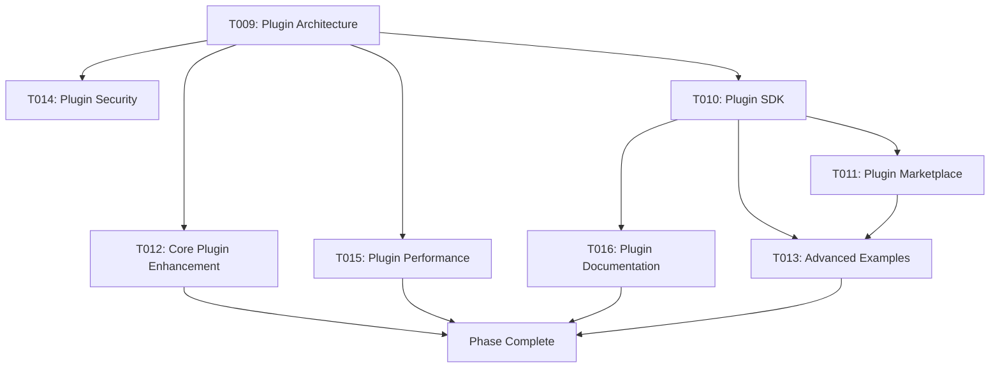

# Phase 002: Plugin System Enhancement & Extension
**Duration**: 3-4 Weeks
**Priority**: High
**Status**: Planning

## Phase Overview
Enhance the plugin system architecture to support more complex plugins, improve developer experience for plugin creation, and establish a robust ecosystem for third-party extensions. This phase focuses on making the plugin system more powerful, flexible, and developer-friendly.

---

## Task List

### T009: Plugin Architecture Redesign
- **Title**: Advanced Plugin Architecture with Dependency Management
- **Description**: Redesign the plugin system to support complex dependency resolution, plugin versioning, and lifecycle management.
- **Details**:
  - Implement plugin version compatibility checking
  - Add plugin dependency resolution system
  - Create plugin lifecycle hooks (beforeLoad, afterLoad, beforeUnload, afterUnload)
  - Implement plugin sandboxing and isolation
  - Add plugin state management and persistence
- **Files**:
  - `src/core/plugin-system.ts` (major architecture update)
  - `src/core/plugin-manager.ts` (new plugin management system)
  - `src/core/plugin-registry.ts` (plugin registry)
  - `src/core/types/plugin.ts` (enhanced plugin types)
  - `tests/unit/plugin-system/` (comprehensive plugin tests)
- **Dependencies**: T001, T002, T003
- **Estimated Hours**: 32
- **Status**: Pending

### T010: Plugin Development Toolkit
- **Title**: Plugin Development SDK & Tooling
- **Description**: Create a comprehensive toolkit for plugin developers including CLI tools, scaffolding, validation, and debugging utilities.
- **Details**:
  - Create plugin CLI for scaffolding and management
  - Implement plugin validation and linting tools
  - Add plugin debugging and profiling utilities
  - Create plugin testing framework and helpers
  - Implement plugin packaging and publishing tools
- **Files**:
  - `tools/plugin-cli/` (CLI tool)
  - `tools/plugin-validator.js` (validation tool)
  - `tools/plugin-debugger.js` (debugging utilities)
  - `templates/plugin-template/` (plugin scaffolding templates)
  - `src/testing/plugin-test-helpers.ts` (testing framework)
  - `docs/plugin-development/` (plugin development guides)
- **Dependencies**: T009
- **Estimated Hours**: 28
- **Status**: Pending

### T011: Plugin Marketplace Infrastructure
- **Title**: Plugin Discovery & Distribution System
- **Description**: Implement infrastructure for plugin discovery, distribution, and automated updates.
- **Details**:
  - Create plugin manifest and metadata system
  - Implement plugin registry and discovery service
  - Add automated plugin update mechanism
  - Create plugin rating and review system
  - Implement plugin analytics and usage tracking
- **Files**:
  - `src/core/plugin-marketplace.ts` (marketplace system)
  - `src/core/plugin-updater.ts` (update mechanism)
  - `tools/plugin-registry.js` (registry management)
  - `docs/plugin-marketplace/` (marketplace documentation)
  - `scripts/plugin-publish.js` (publishing script)
- **Dependencies**: T010
- **Estimated Hours**: 24
- **Status**: Pending

### T012: Core Plugin Enhancements
- **Title**: Core Plugins Performance & Feature Enhancement
- **Description**: Enhance existing core plugins with new features, better performance, and improved APIs.
- **Details**:
  - Enhance holiday engine with regional holiday packages
  - Improve business day calculations with custom schedules
  - Add advanced parsing strategies and formats
  - Implement timezone conversion with DST support
  - Add duration and range calculation optimizations
- **Files**:
  - `src/plugins/holiday/` (enhanced holiday engine)
  - `src/plugins/business/` (improved business day calculations)
  - `src/plugins/parse/` (advanced parsing strategies)
  - `src/plugins/timezone/` (timezone enhancements)
  - `src/plugins/duration/` (duration optimizations)
  - `src/plugins/range/` (range calculation improvements)
- **Dependencies**: T009
- **Estimated Hours**: 36
- **Status**: Pending

### T013: Advanced Plugin Examples
- **Title**: Sophisticated Plugin Examples & Use Cases
- **Description**: Create advanced plugin examples showcasing the full potential of the enhanced plugin system.
- **Details**:
  - Financial calendar plugin with market holidays
  - Astronomical calculations plugin (moon phases, seasons)
  - Recurring events plugin with complex patterns
  - Timezone converter plugin with historical data
  - Custom business calendar plugin for specific industries
- **Files**:
  - `examples/plugins/financial-calendar/` (financial plugin)
  - `examples/plugins/astronomical/` (astronomical plugin)
  - `examples/plugins/recurring-events/` (recurring events)
  - `examples/plugins/timezone-converter/` (timezone converter)
  - `examples/plugins/business-calendar/` (business calendar)
  - `docs/plugin-examples/` (plugin examples documentation)
- **Dependencies**: T010, T012
- **Estimated Hours**: 20
- **Status**: Pending

### T014: Plugin Security & Validation
- **Title**: Plugin Security Framework & Runtime Validation
- **Description**: Implement security measures and runtime validation to ensure plugin safety and integrity.
- **Details**:
  - Create plugin security sandbox and permissions system
  - Implement runtime validation and monitoring
  - Add plugin signature verification
  - Create security audit and vulnerability scanning
  - Implement plugin resource limits and monitoring
- **Files**:
  - `src/core/plugin-security.ts` (security framework)
  - `src/core/plugin-validator.ts` (runtime validation)
  - `src/core/plugin-monitor.ts` (resource monitoring)
  - `tools/plugin-scanner.js` (security scanner)
  - `docs/plugin-security/` (security documentation)
- **Dependencies**: T009, T011
- **Estimated Hours**: 24
- **Status**: Pending

### T015: Plugin Performance Optimization
- **Title**: Plugin Performance Profiling & Optimization
- **Description**: Implement performance profiling and optimization tools specifically for plugins.
- **Details**:
  - Create plugin performance profiling tools
  - Implement lazy loading and code splitting for plugins
  - Add plugin performance monitoring and alerts
  - Optimize plugin loading and initialization
  - Implement plugin caching strategies
- **Files**:
  - `src/core/plugin-profiler.ts` (profiling tools)
  - `src/core/plugin-loader.ts` (optimized loading)
  - `src/core/plugin-cache.ts` (plugin caching)
  - `tools/plugin-profiler.js` (profiling CLI)
  - `tests/performance/plugin-performance.test.ts` (performance tests)
- **Dependencies**: T009, T014
- **Estimated Hours**: 18
- **Status**: Pending

### T016: Plugin Documentation & API Reference
- **Title**: Comprehensive Plugin Documentation & API Reference
- **Description**: Create comprehensive documentation for plugin development, API reference, and best practices.
- **Details**:
  - Complete plugin API reference with examples
  - Create plugin development tutorials and guides
  - Document plugin architecture and design patterns
  - Create troubleshooting and debugging guides
  - Add plugin performance optimization guides
- **Files**:
  - `docs/plugin-api/` (API reference)
  - `docs/plugin-tutorials/` (tutorials and guides)
  - `docs/plugin-patterns/` (design patterns)
  - `docs/plugin-troubleshooting/` (troubleshooting guides)
  - `docs/plugin-performance/` (performance guides)
- **Dependencies**: T010, T013
- **Estimated Hours**: 16
- **Status**: Pending

---

## Task Groups

### Core Architecture Group
- **Tasks**: T009, T014, T015
- **Focus**: Plugin system architecture, security, and performance
- **Critical Path**: High priority, foundation for all other plugin work

### Developer Experience Group
- **Tasks**: T010, T016
- **Focus**: Plugin development tools and documentation
- **Dependencies**: Core architecture group

### Ecosystem & Distribution Group
- **Tasks**: T011, T013
- **Focus**: Plugin marketplace, distribution, and examples
- **Dependencies**: Developer experience group

### Feature Enhancement Group
- **Tasks**: T012
- **Focus**: Enhancing existing core plugins
- **Dependencies**: Core architecture group

---

## Task Flow

## Phase Success Criteria

1. **Plugin Architecture**: Support for complex dependency resolution and lifecycle management
2. **Developer Experience**: Complete SDK with CLI tools and scaffolding
3. **Security**: Comprehensive plugin security framework with sandboxing
4. **Performance**: 40% faster plugin loading and 30% better runtime performance
5. **Documentation**: Complete plugin development documentation with 95% API coverage
6. **Ecosystem**: Working plugin marketplace with automated distribution
7. **Examples**: 5+ sophisticated plugin examples demonstrating full capabilities

## Risks & Mitigations

### Technical Risks
- **Complexity in dependency resolution**: Mitigate with thorough testing and validation
- **Performance overhead**: Mitigate with lazy loading and caching strategies
- **Security vulnerabilities**: Mitigate with comprehensive security audit and sandboxing

### Ecosystem Risks
- **Low plugin adoption**: Mitigate with excellent developer experience and documentation
- **Plugin quality issues**: Mitigate with validation tools and marketplace moderation
- **Maintenance burden**: Mitigate with automated testing and community contribution tools

## Deliverables

1. Enhanced plugin architecture with dependency management
2. Comprehensive plugin development SDK and CLI tools
3. Plugin marketplace infrastructure
4. Optimized core plugins with new features
5. Advanced plugin examples showcasing full capabilities
6. Plugin security framework with sandboxing
7. Plugin performance optimization tools
8. Complete plugin documentation and API reference

## Next Phase Preparation

This phase prepares the foundation for:
- Phase 003: Holiday Engine Advanced Features
- Phase 004: Internationalization Expansion
- Phase 005: Ecosystem & Community Building
- Phase 006: Enterprise Features & Advanced Use Cases