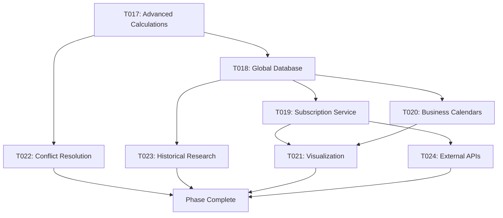

# Phase 003: Holiday Engine Advanced Features & Global Expansion
**Duration**: 4-5 Weeks
**Priority**: High
**Status**: Planning

## Phase Overview
Enhance the holiday engine with advanced features, expand global holiday coverage, implement sophisticated calculation methods, and create comprehensive holiday management tools. This phase establishes Kairos as the definitive holiday calculation system for global applications.

---

## Task List

### T017: Advanced Holiday Calculation Engine
- **Title**: Sophisticated Holiday Calculation Algorithms
- **Description**: Implement advanced holiday calculation algorithms including complex rules, historical changes, and edge cases.
- **Details**:
  - Implement advanced lunar calendar calculations (Chinese, Hebrew, Islamic)
  - Add complex Easter calculation methods (Orthodox, Julian calendar)
  - Create conditional holiday rules (e.g., "unless on weekend")
  - Implement historical holiday tracking and changes over time
  - Add multi-day holiday support with partial observances
- **Files**:
  - `src/plugins/holiday/calculators/advanced-lunar.ts` (new lunar calculator)
  - `src/plugins/holiday/calculators/orthodox-easter.ts` (Orthodox Easter)
  - `src/plugins/holiday/calculators/conditional.ts` (conditional rules)
  - `src/plugins/holiday/calculators/historical.ts` (historical tracking)
  - `src/plugins/holiday/types/advanced.ts` (advanced type definitions)
  - `tests/unit/holiday/advanced-calculators.test.ts` (comprehensive tests)
- **Dependencies**: T009, T012
- **Estimated Hours**: 40
- **Status**: Pending

### T018: Global Holiday Database Expansion
- **Title**: Comprehensive Global Holiday Database
- **Description**: Expand the holiday database to cover 50+ countries with detailed regional variations and historical accuracy.
- **Details**:
  - Add 30+ new country holiday packages
  - Implement state/province-level holidays for federal countries
  - Add regional observances and cultural holidays
  - Create historical holiday database (last 100+ years)
  - Implement holiday data validation and verification system
- **Files**:
  - `src/plugins/locale/[new-countries]/` (new locale packages)
  - `src/plugins/holiday/database/` (holiday database system)
  - `src/plugins/holiday/validator.ts` (data validation)
  - `tools/holiday-data-importer.js` (data import tools)
  - `tools/holiday-validator.js` (validation tools)
  - `tests/integration/holiday-data.test.ts` (data validation tests)
- **Dependencies**: T017
- **Estimated Hours**: 48
- **Status**: Pending

### T019: Holiday Subscription & Update Service
- **Title**: Real-time Holiday Data Updates & Subscription Service
- **Description**: Implement a subscription service for automatic holiday data updates and real-time holiday information.
- **Details**:
  - Create holiday data subscription API
  - Implement automatic holiday data updates
  - Add holiday change notifications and alerts
  - Create holiday data versioning and rollback system
  - Implement caching strategies for subscription data
- **Files**:
  - `src/plugins/holiday/subscription.ts` (subscription service)
  - `src/plugins/holiday/updater.ts` (automatic updates)
  - `src/plugins/holiday/notifications.ts` (change notifications)
  - `src/plugins/holiday/versioning.ts` (data versioning)
  - `tools/holiday-server.js` (mock subscription server)
  - `tests/unit/holiday/subscription.test.ts` (subscription tests)
- **Dependencies**: T018
- **Estimated Hours**: 32
- **Status**: Pending

### T020: Business Calendar Customization
- **Title**: Advanced Business Calendar Customization System
- **Description**: Create a sophisticated system for customizing business calendars with specific work schedules, regional variations, and company-specific holidays.
- **Details**:
  - Implement custom work schedule patterns (4-day weeks, flexible hours)
  - Add company-specific holiday systems
  - Create regional business day variations
  - Implement industry-specific business calendars
  - Add business calendar sharing and templates
- **Files**:
  - `src/plugins/business/custom-schedules.ts` (custom schedules)
  - `src/plugins/business/company-holidays.ts` (company holidays)
  - `src/plugins/business/industry-calendars.ts` (industry calendars)
  - `src/plugins/business/calendar-templates.ts` (calendar templates)
  - `src/plugins/business/calendar-sharing.ts` (sharing system)
  - `tests/unit/business/custom-calendars.test.ts` (custom calendar tests)
- **Dependencies**: T012, T017
- **Estimated Hours**: 28
- **Status**: Pending

### T021: Holiday Visualization & Analytics
- **Title**: Holiday Data Visualization & Analytics Dashboard
- **Description**: Create tools for visualizing holiday data, analyzing patterns, and generating insights.
- **Details**:
  - Implement holiday calendar visualization components
  - Create holiday pattern analysis tools
  - Add holiday density and distribution analytics
  - Create custom holiday report generation
  - Implement holiday trend analysis and forecasting
- **Files**:
  - `src/plugins/visualization/holiday-calendar.ts` (calendar visualization)
  - `src/plugins/analytics/holiday-patterns.ts` (pattern analysis)
  - `src/plugins/analytics/holiday-reports.ts` (report generation)
  - `tools/holiday-analytics.js` (analytics CLI tool)
  - `examples/holiday-visualization/` (visualization examples)
  - `tests/unit/visualization/` (visualization tests)
- **Dependencies**: T019
- **Estimated Hours**: 24
- **Status**: Pending

### T022: Holiday Conflict Resolution
- **Title**: Advanced Holiday Conflict Resolution & Management
- **Description**: Implement sophisticated conflict resolution for overlapping holidays, priority systems, and regional variations.
- **Details**:
  - Create holiday priority and hierarchy system
  - Implement conflict resolution algorithms
  - Add regional conflict handling
  - Create custom conflict resolution rules
  - Implement holiday observance optimization
- **Files**:
  - `src/plugins/holiday/conflict-resolution.ts` (conflict system)
  - `src/plugins/holiday/priority-system.ts` (priority management)
  - `src/plugins/holiday/observance-optimizer.ts` (observance optimization)
  - `src/plugins/holiday/regional-conflicts.ts` (regional handling)
  - `tests/unit/holiday/conflicts.test.ts` (conflict resolution tests)
- **Dependencies**: T018, T020
- **Estimated Hours**: 20
- **Status**: Pending

### T023: Historical Holiday Research System
- **Title**: Historical Holiday Research & Verification System
- **Description**: Create tools for researching historical holidays, verifying data accuracy, and maintaining historical integrity.
- **Details**:
  - Implement historical holiday research tools
  - Create holiday data verification and citation system
  - Add historical calendar conversion tools
  - Create holiday change tracking and documentation
  - Implement peer review system for holiday data
- **Files**:
  - `tools/holiday-researcher.js` (research tools)
  - `src/plugins/holiday/historical-verification.ts` (verification system)
  - `src/plugins/holiday/calendar-conversion.ts` (historical conversion)
  - `src/plugins/holiday/change-tracking.ts` (change tracking)
  - `docs/historical-research/` (research documentation)
- **Dependencies**: T018
- **Estimated Hours**: 24
- **Status**: Pending

### T024: Holiday API Integration
- **Title**: External Holiday API Integration & Data Sync
- **Description**: Integrate with external holiday data APIs and implement synchronization systems for data consistency.
- **Details**:
  - Create external API integration framework
  - Implement government holiday API integrations
  - Add data synchronization and conflict resolution
  - Create API rate limiting and caching strategies
  - Implement fallback and redundancy systems
- **Files**:
  - `src/plugins/holiday/external-apis.ts` (API integration framework)
  - `src/plugins/holiday/government-apis/` (government API integrations)
  - `src/plugins/holiday/data-sync.ts` (synchronization system)
  - `src/plugins/holiday/api-cache.ts` (API caching)
  - `tests/integration/external-apis.test.ts` (API integration tests)
- **Dependencies**: T019
- **Estimated Hours**: 20
- **Status**: Pending

---

## Task Groups

### Core Calculation Engine Group
- **Tasks**: T017, T022
- **Focus**: Advanced calculation algorithms and conflict resolution
- **Critical Path**: High priority, foundation for holiday engine enhancements

### Data & Database Group
- **Tasks**: T018, T023
- **Focus**: Global holiday database expansion and historical research
- **Dependencies**: Core calculation engine group

### Real-time & Updates Group
- **Tasks**: T019, T024
- **Focus**: Subscription services and external API integration
- **Dependencies**: Data & Database group

### Business & Analytics Group
- **Tasks**: T020, T021
- **Focus**: Business calendar customization and analytics
- **Dependencies**: Core calculation engine and data groups

---

## Task Flow

## Phase Success Criteria

1. **Global Coverage**: 50+ countries with comprehensive holiday data
2. **Accuracy**: 99.9% accuracy in holiday calculations with verification
3. **Historical Data**: 100+ years of historical holiday data
4. **Real-time Updates**: Automatic holiday data updates with 24-hour sync
5. **Business Calendars**: Support for complex business calendar customizations
6. **Visualization**: Interactive holiday calendar with analytics
7. **API Integration**: Integration with major government holiday APIs

## Risks & Mitigations

### Data Accuracy Risks
- **Incorrect holiday data**: Mitigate with verification systems and multiple sources
- **Historical inaccuracies**: Mitigate with peer review and citation systems
- **Regional variations**: Mitigate with local validation and community feedback

### Technical Risks
- **Performance with large datasets**: Mitigate with efficient caching and lazy loading
- **API rate limiting**: Mitigate with intelligent caching and fallback systems
- **Complex calculation errors**: Mitigate with comprehensive testing and validation

### Maintenance Risks
- **Data maintenance overhead**: Mitigate with automation and community contributions
- **API changes**: Mitigate with abstraction layers and fallback systems

## Deliverables

1. Advanced holiday calculation engine with complex algorithms
2. Comprehensive global holiday database covering 50+ countries
3. Real-time holiday subscription and update service
4. Advanced business calendar customization system
5. Holiday visualization and analytics dashboard
6. Holiday conflict resolution and management system
7. Historical holiday research and verification system
8. External holiday API integration framework

## Next Phase Preparation

This phase prepares the foundation for:
- Phase 004: Internationalization Expansion
- Phase 005: Ecosystem & Community Building
- Phase 006: Enterprise Features & Advanced Use Cases
- Phase 007: Performance & Scalability Optimization