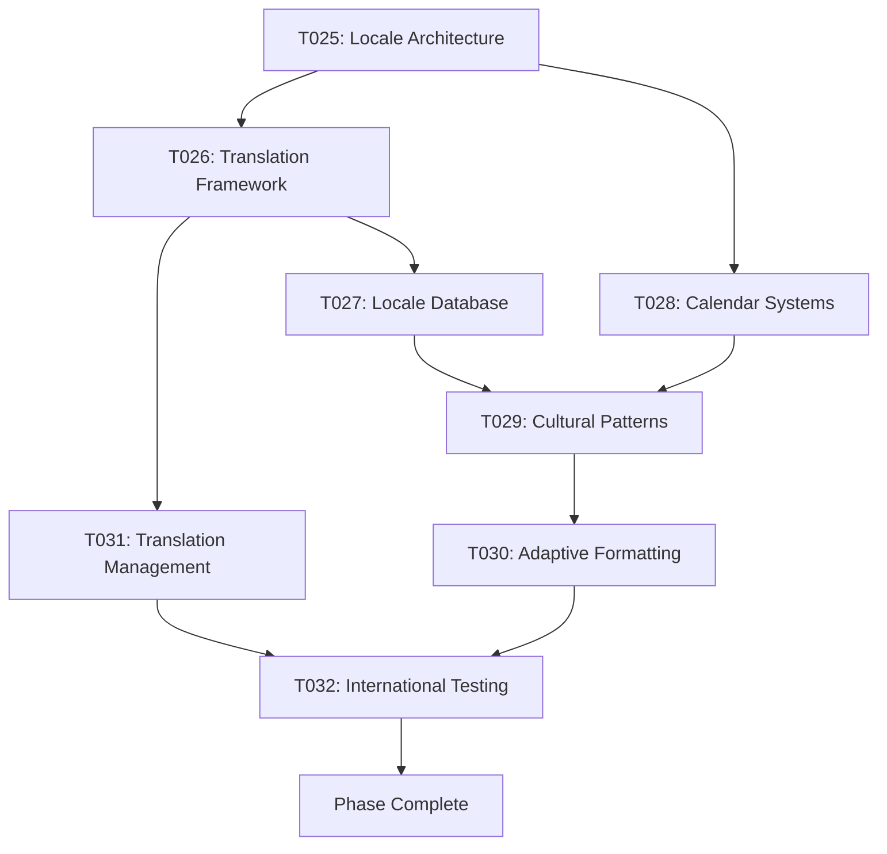

# Phase 004: Internationalization Expansion & Cultural Adaptation
**Duration**: 3-4 Weeks
**Priority**: High
**Status**: Planning

## Phase Overview
Expand internationalization capabilities beyond holidays to include full cultural adaptation, comprehensive locale support, and sophisticated formatting/translation systems. This phase establishes Kairos as a truly global date/time library with deep cultural understanding.

---

## Task List

### T025: Advanced Locale System Architecture
- **Title**: Sophisticated Locale Management & Cultural Adaptation System
- **Description**: Design and implement an advanced locale system that handles complex cultural variations, regional preferences, and cultural nuances.
- **Details**:
  - Implement hierarchical locale system (language -> region -> dialect)
  - Create cultural preference profiles (work weeks, weekends, holidays)
  - Add locale inheritance and fallback mechanisms
  - Implement dynamic locale switching with state preservation
  - Create locale validation and compatibility checking
- **Files**:
  - `src/core/locale-architecture.ts` (new locale architecture)
  - `src/core/cultural-profiles.ts` (cultural preference system)
  - `src/core/locale-inheritance.ts` (inheritance system)
  - `src/core/locale-validator.ts` (locale validation)
  - `src/types/locales.ts` (enhanced locale types)
  - `tests/unit/locales/architecture.test.ts` (architecture tests)
- **Dependencies**: T003, T009
- **Estimated Hours**: 36
- **Status**: Pending

### T026: Translation & Localization Framework
- **Title**: Comprehensive Translation & Localization Framework
- **Description**: Create a complete translation and localization framework supporting multiple scripts, right-to-left languages, and cultural adaptations.
- **Details**:
  - Implement pluralization rules for different languages
  - Add gender support for languages requiring it
  - Create right-to-left (RTL) language support
  - Implement multiple script support (Latin, Cyrillic, Arabic, etc.)
  - Add cultural number and date formatting variations
- **Files**:
  - `src/i18n/translation-engine.ts` (translation system)
  - `src/i18n/pluralization.ts` (pluralization rules)
  - `src/i18n/rtl-support.ts` (RTL language support)
  - `src/i18n/script-support.ts` (multiple scripts)
  - `src/i18n/cultural-formatting.ts` (cultural formatting)
  - `translations/` (translation files for all supported languages)
  - `tests/unit/i18n/` (comprehensive i18n tests)
- **Dependencies**: T025
- **Estimated Hours**: 32
- **Status**: Pending

### T027: Extended Locale Database (30+ New Locales)
- **Title**: Global Locale Database Expansion
- **Description**: Expand locale support to 40+ total locales with comprehensive cultural data and regional variations.
- **Details**:
  - Add 30+ new locale packages covering major world languages
  - Implement regional variations for major languages (en-GB, en-AU, fr-CA, etc.)
  - Create cultural calendars and work week patterns
  - Add local naming conventions and honorifics
  - Implement cultural holiday observances and traditions
- **Files**:
  - `src/plugins/locale/[new-locales]/` (30+ new locale packages)
  - `src/i18n/cultural-calendars.ts` (cultural calendar systems)
  - `src/i18n/work-week-patterns.ts` (work week variations)
  - `src/i18n/naming-conventions.ts` (local naming systems)
  - `tools/locale-generator.js` (locale scaffolding tool)
  - `tests/integration/locales/` (locale integration tests)
- **Dependencies**: T025, T026
- **Estimated Hours**: 48
- **Status**: Pending

### T028: Cultural Calendar Systems
- **Title**: Multiple Calendar System Support
- **Description**: Implement support for multiple calendar systems including Islamic, Hebrew, Chinese, Buddhist, and other cultural calendars.
- **Details**:
  - Implement Hijri (Islamic) calendar system
  - Add Hebrew (Jewish) calendar support
  - Create Chinese lunisolar calendar system
  - Add Buddhist calendar support
  - Implement calendar conversion between systems
  - Create calendar system interoperability
- **Files**:
  - `src/calendars/hijri-calendar.ts` (Islamic calendar)
  - `src/calendars/hebrew-calendar.ts` (Hebrew calendar)
  - `src/calendars/chinese-calendar.ts` (Chinese calendar)
  - `src/calendars/buddhist-calendar.ts` (Buddhist calendar)
  - `src/calendars/converter.ts` (calendar conversion)
  - `src/calendars/interop.ts` (interoperability)
  - `tests/unit/calendars/` (calendar system tests)
- **Dependencies**: T017, T025
- **Estimated Hours**: 40
- **Status**: Pending

### T029: Cultural Time & Work Patterns
- **Title**: Cultural Time Perception & Work Pattern Integration
- **Description**: Integrate cultural time perceptions, work patterns, and social customs into the date/time system.
- **Details**:
  - Implement cultural time perception models (polychronic vs monochronic)
  - Add culturally specific work patterns and business hours
  - Create social custom integration (siesta, prayer times, etc.)
  - Implement seasonal cultural variations
  - Add cultural event and festival integration
- **Files**:
  - `src/cultural/time-perception.ts` (cultural time models)
  - `src/cultural/work-patterns.ts` (cultural work patterns)
  - `src/cultural/social-customs.ts` (social customs)
  - `src/cultural/seasonal-variations.ts` (seasonal patterns)
  - `src/cultural/events.ts` (cultural events)
  - `tests/unit/cultural/` (cultural integration tests)
- **Dependencies**: T027, T028
- **Estimated Hours**: 24
- **Status**: Pending

### T030: Adaptive Formatting System
- **Title**: Culturally Adaptive Formatting & Display System
- **Description**: Create an adaptive formatting system that automatically adjusts to cultural preferences and contexts.
- **Details**:
  - Implement culturally aware date/time formatting
  - Add context-aware formatting (formal vs informal)
  - Create adaptive numerical formatting
  - Implement cultural symbol and icon integration
  - Add accessibility-focused formatting options
- **Files**:
  - `src/formatting/adaptive-formatter.ts` (adaptive formatting)
  - `src/formatting/context-aware.ts` (context awareness)
  - `src/formatting/numerical.ts` (numerical formatting)
  - `src/formatting/cultural-symbols.ts` (cultural symbols)
  - `src/formatting/accessibility.ts` (accessibility)
  - `tests/unit/formatting/` (formatting tests)
- **Dependencies**: T026, T029
- **Estimated Hours**: 20
- **Status**: Pending

### T031: Translation Management Tools
- **Title**: Translation Management & Community Contribution System
- **Description**: Create tools for managing translations, validating linguistic accuracy, and enabling community contributions.
- **Details**:
  - Implement translation management CLI tool
  - Create translation validation and quality checking
  - Add community translation contribution system
  - Implement translation versioning and synchronization
  - Create translation memory and consistency tools
- **Files**:
  - `tools/translation-manager.js` (translation CLI)
  - `tools/translation-validator.js` (validation tool)
  - `src/i18n/community-translations.ts` (community system)
  - `src/i18n/translation-memory.ts` (translation memory)
  - `tools/translation-sync.js` (synchronization tool)
  - `docs/translation-contributing/` (contribution guides)
- **Dependencies**: T026, T027
- **Estimated Hours**: 24
- **Status**: Pending

### T032: International Testing & Validation
- **Title**: Comprehensive Internationalization Testing Framework
- **Description**: Create a comprehensive testing framework for validating internationalization features across different locales and cultural contexts.
- **Details**:
  - Implement locale-specific testing frameworks
  - Create cultural validation test suites
  - Add linguistic accuracy testing
  - Implement cross-cultural compatibility testing
  - Create performance testing for different locales
- **Files**:
  - `tests/international/` (internationalization test framework)
  - `tests/international/locales/` (locale-specific tests)
  - `tests/international/cultural/` (cultural validation tests)
  - `tests/international/linguistic/` (linguistic accuracy tests)
  - `tools/i18n-test-runner.js` (i18n test runner)
  - `tests/international/performance/` (locale performance tests)
- **Dependencies**: T030, T031
- **Estimated Hours**: 20
- **Status**: Pending

---

## Task Groups

### Core Architecture Group
- **Tasks**: T025, T028
- **Focus**: Locale system architecture and calendar system integration
- **Critical Path**: High priority, foundation for all internationalization work

### Translation & Localization Group
- **Tasks**: T026, T031
- **Focus**: Translation framework and management tools
- **Dependencies**: Core architecture group

### Data & Culture Group
- **Tasks**: T027, T029
- **Focus**: Locale database expansion and cultural integration
- **Dependencies**: Translation & localization group

### Display & Testing Group
- **Tasks**: T030, T032
- **Focus**: Adaptive formatting and comprehensive testing
- **Dependencies**: Data & culture group

---

## Task Flow

## Phase Success Criteria

1. **Locale Coverage**: 40+ locales with comprehensive cultural data
2. **Translation Quality**: 100% translation coverage with community validation
3. **Calendar Systems**: Support for 5+ major calendar systems with accurate conversion
4. **Cultural Adaptation**: Deep cultural integration including work patterns and customs
5. **Adaptive Formatting**: Context-aware formatting for all supported locales
6. **Community Engagement**: Active translation community contribution system
7. **Testing Coverage**: Comprehensive internationalization testing with 95% coverage

## Risks & Mitigations

### Cultural Accuracy Risks
- **Cultural misrepresentation**: Mitigate with native speaker review and cultural consultants
- **Regional variations**: Mitigate with local validation and community feedback
- **Religious sensitivity**: Mitigate with religious expert consultation and respectful implementation

### Technical Risks
- **Performance with many locales**: Mitigate with lazy loading and efficient caching
- **Translation consistency**: Mitigate with translation memory and validation tools
- **Calendar system complexity**: Mitigate with extensive testing and expert review

### Maintenance Risks
- **Translation maintenance overhead**: Mitigate with community contribution system
- **Cultural data updates**: Mitigate with automated validation and community reporting

## Deliverables

1. Advanced locale system architecture with cultural adaptation
2. Comprehensive translation and localization framework
3. Extended locale database with 40+ locales
4. Multiple calendar system support with accurate conversion
5. Cultural time perception and work pattern integration
6. Adaptive formatting system with cultural awareness
7. Translation management and community contribution tools
8. Comprehensive internationalization testing framework

## Next Phase Preparation

This phase prepares the foundation for:
- Phase 005: Ecosystem & Community Building
- Phase 006: Enterprise Features & Advanced Use Cases
- Phase 007: Performance & Scalability Optimization
- Phase 008: AI & Machine Learning Integration