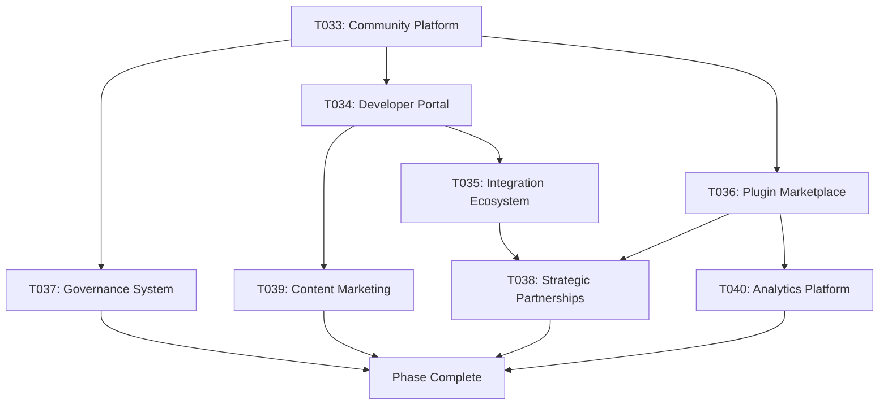

# Phase 005: Ecosystem & Community Building
**Duration**: 4-6 Weeks
**Priority**: High
**Status**: Planning

## Phase Overview
Build a comprehensive ecosystem around Kairos including community engagement, developer resources, integration ecosystem, and strategic partnerships. This phase focuses on establishing Kairos as a leading date/time library with strong community support and extensive integration capabilities.

---

## Task List

### T033: Community Platform & Infrastructure
- **Title**: Comprehensive Community Platform & Engagement Infrastructure
- **Description**: Create a robust community platform with forums, discussion boards, knowledge base, and community contribution tools.
- **Details**:
  - Implement community forum and discussion platform
  - Create knowledge base and wiki system
  - Add community recognition and reputation system
  - Implement community event management (webinars, meetups)
  - Create community dashboard and analytics
- **Files**:
  - `community/` (community platform structure)
  - `community/forum/` (forum system)
  - `community/knowledge-base/` (wiki and knowledge base)
  - `community/reputation/` (reputation system)
  - `community/events/` (event management)
  - `tools/community-analytics.js` (community analytics)
  - `community/dashboard/` (community dashboard)
- **Dependencies**: T011, T016
- **Estimated Hours**: 40
- **Status**: Pending

### T034: Developer Portal & Resource Center
- **Title**: Comprehensive Developer Portal & Learning Resource Center
- **Description**: Create a comprehensive developer portal with tutorials, courses, documentation, and learning resources.
- **Details**:
  - Implement interactive tutorial system
  - Create video course platform
  - Add coding playground and sandbox environment
  - Implement certification and badge system
  - Create developer career resources and job board
- **Files**:
  - `developer-portal/` (developer platform)
  - `developer-portal/tutorials/` (interactive tutorials)
  - `developer-portal/courses/` (video courses)
  - `developer-portal/playground/` (coding sandbox)
  - `developer-portal/certification/` (certification system)
  - `developer-portal/careers/` (job board and resources)
  - `tools/portal-analytics.js` (portal analytics)
- **Dependencies**: T033, T008
- **Estimated Hours**: 36
- **Status**: Pending

### T035: Integration Ecosystem & Framework Support
- **Title**: Framework Integration Ecosystem & Adapter System
- **Description**: Create comprehensive integration support for major frameworks, libraries, and platforms.
- **Details**:
  - Implement React adapter and components
  - Create Vue.js integration package
  - Add Angular modules and services
  - Implement Node.js backend integrations
  - Create mobile framework adapters (React Native, Flutter)
  - Add CMS and platform integrations (WordPress, Shopify, etc.)
- **Files**:
  - `integrations/react/` (React integration)
  - `integrations/vue/` (Vue.js integration)
  - `integrations/angular/` (Angular integration)
  - `integrations/node/` (Node.js integration)
  - `integrations/mobile/` (mobile adapters)
  - `integrations/platforms/` (platform integrations)
  - `tools/integration-generator.js` (integration scaffolding)
- **Dependencies**: T010, T016
- **Estimated Hours**: 44
- **Status**: Pending

### T036: Plugin Marketplace & Distribution Platform
- **Title**: Advanced Plugin Marketplace & Distribution Platform
- **Description**: Build a sophisticated plugin marketplace with advanced features for plugin discovery, distribution, and monetization.
- **Details**:
  - Implement plugin marketplace UI and search
  - Add plugin rating and review system
  - Create plugin monetization and payment system
  - Implement plugin analytics and usage tracking
  - Add plugin testing and certification system
- **Files**:
  - `marketplace/` (marketplace platform)
  - `marketplace/ui/` (marketplace interface)
  - `marketplace/reviews/` (rating and review system)
  - `marketplace/monetization/` (payment system)
  - `marketplace/analytics/` (usage analytics)
  - `marketplace/certification/` (plugin certification)
  - `tools/marketplace-admin.js` (admin tools)
- **Dependencies**: T011, T033
- **Estimated Hours**: 32
- **Status**: Pending

### T037: Open Source Governance & Contribution System
- **Title**: Open Source Governance & Community Contribution Framework
- **Description**: Establish comprehensive open source governance with clear contribution guidelines, code review processes, and community decision-making.
- **Details**:
  - Implement contribution workflow automation
  - Create code review and quality assurance system
  - Add community voting and decision-making
  - Implement contributor recognition and rewards
  - Create governance documentation and policies
- **Files**:
  - `governance/` (governance framework)
  - `governance/contributions/` (contribution system)
  - `governance/reviews/` (code review system)
  - `governance/voting/` (decision-making system)
  - `governance/recognition/` (contributor recognition)
  - `governance/policies/` (governance policies)
  - `tools/contribution-bot.js` (automation bot)
- **Dependencies**: T033, T034
- **Estimated Hours**: 28
- **Status**: Pending

### T038: Strategic Partnerships & Integration Program
- **Title**: Strategic Partnership Program & Third-Party Integration
- **Description**: Establish strategic partnerships with major companies, platforms, and developer tools to expand Kairos ecosystem.
- **Details**:
  - Create partnership program and onboarding
  - Implement enterprise integration support
  - Add technology partner certification
  - Create co-marketing and promotional programs
  - Implement partner analytics and success tracking
- **Files**:
  - `partnerships/` (partnership program)
  - `partnerships/onboarding/` (partner onboarding)
  - `partnerships/enterprise/` (enterprise integration)
  - `partnerships/certification/` (partner certification)
  - `partnerships/marketing/` (co-marketing programs)
  - `partnerships/analytics/` (partner success tracking)
  - `tools/partner-portal.js` (partner portal)
- **Dependencies**: T035, T036
- **Estimated Hours**: 24
- **Status**: Pending

### T039: Content Marketing & Thought Leadership
- **Title**: Content Marketing Strategy & Thought Leadership Program
- **Description**: Establish Kairos as a thought leader in date/time libraries through comprehensive content marketing and educational content.
- **Details**:
  - Create technical blog and article series
  - Implement podcast and video content
  - Add whitepaper and research publication system
  - Create conference and speaking engagement program
  - Implement social media and community outreach
- **Files**:
  - `content/` (content marketing hub)
  - `content/blog/` (technical blog)
  - `content/podcast/` (podcast content)
  - `content/research/` (research publications)
  - `content/conferences/` (speaking engagements)
  - `content/social/` (social media content)
  - `tools/content-calendar.js` (content management)
- **Dependencies**: T034, T038
- **Estimated Hours**: 20
- **Status**: Pending

### T040: Analytics & Success Metrics Platform
- **Title**: Comprehensive Analytics & Success Metrics Platform
- **Description**: Build a sophisticated analytics platform to track ecosystem health, user engagement, and success metrics.
- **Details**:
  - Implement comprehensive usage analytics
  - Create ecosystem health monitoring
  - Add user behavior and engagement tracking
  - Implement A/B testing and optimization platform
  - Create success metrics and KPI dashboard
- **Files**:
  - `analytics/` (analytics platform)
  - `analytics/usage/` (usage analytics)
  - `analytics/ecosystem/` (ecosystem health)
  - `analytics/engagement/` (user engagement)
  - `analytics/experiments/` (A/B testing)
  - `analytics/dashboard/` (metrics dashboard)
  - `tools/analytics-collector.js` (data collection)
- **Dependencies**: T033, T036
- **Estimated Hours**: 24
- **Status**: Pending

---

## Task Groups

### Community Infrastructure Group
- **Tasks**: T033, T037
- **Focus**: Community platform and governance systems
- **Critical Path**: High priority, foundation for ecosystem growth

### Developer Resources Group
- **Tasks**: T034, T039
- **Focus**: Developer portal and content marketing
- **Dependencies**: Community infrastructure group

### Integration & Marketplace Group
- **Tasks**: T035, T036
- **Focus**: Framework integrations and plugin marketplace
- **Dependencies**: Developer resources group

### Partnership & Analytics Group
- **Tasks**: T038, T040
- **Focus**: Strategic partnerships and success metrics
- **Dependencies**: Integration & marketplace group

---

## Task Flow

## Phase Success Criteria

1. **Community Engagement**: 1000+ active community members within 6 months
2. **Developer Resources**: 50+ tutorials, 20+ video courses, 1000+ certified developers
3. **Framework Integration**: 10+ major framework integrations with 50K+ downloads
4. **Plugin Marketplace**: 100+ plugins with 10K+ marketplace users
5. **Open Source Governance**: Active community with 100+ contributors
6. **Strategic Partnerships**: 5+ major technology partnerships
7. **Content Marketing**: 100+ technical articles, 50+ podcast episodes
8. **Analytics Success**: Comprehensive metrics with clear KPI achievement

## Risks & Mitigations

### Community Engagement Risks
- **Low community participation**: Mitigate with engaging content and recognition programs
- **Toxic community behavior**: Mitigate with clear moderation policies and tools
- **Contributor burnout**: Mitigate with recognition and support systems

### Technical Risks
- **Platform scalability**: Mitigate with cloud infrastructure and load balancing
- **Integration complexity**: Mitigate with thorough testing and documentation
- **Security vulnerabilities**: Mitigate with security audits and best practices

### Business Risks
- **Partnership delays**: Mitigate with multiple partnership pipelines
- **Market competition**: Mitigate with differentiation and strong value proposition
- **Resource constraints**: Mitigate with community contribution and automation

## Deliverables

1. Comprehensive community platform with engagement tools
2. Developer portal with tutorials and certification programs
3. Framework integration ecosystem with 10+ major integrations
4. Advanced plugin marketplace with monetization
5. Open source governance framework with contribution automation
6. Strategic partnership program with enterprise support
7. Content marketing and thought leadership platform
8. Comprehensive analytics and success metrics platform

## Next Phase Preparation

This phase prepares the foundation for:
- Phase 006: Enterprise Features & Advanced Use Cases
- Phase 007: Performance & Scalability Optimization
- Phase 008: AI & Machine Learning Integration
- Phase 009: Global Launch & Market Expansion