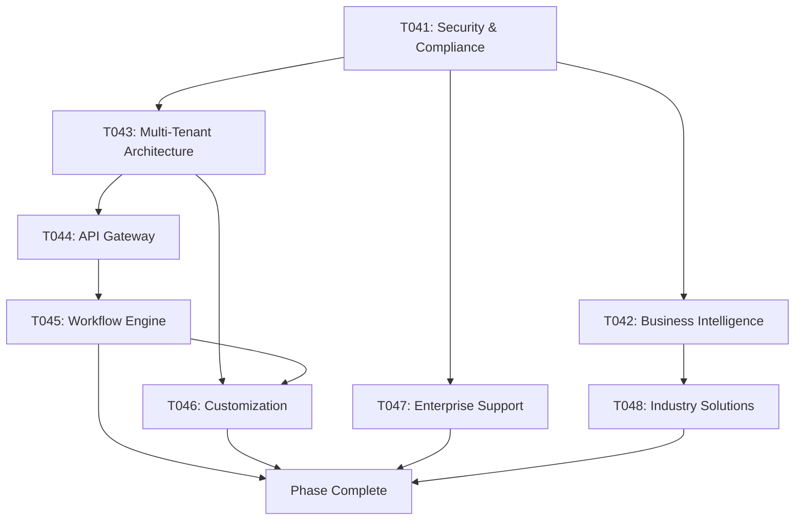

# Phase 006: Enterprise Features & Advanced Use Cases
**Duration**: 5-6 Weeks
**Priority**: High
**Status**: Planning

## Phase Overview
Develop enterprise-grade features, advanced business capabilities, and specialized solutions for large-scale organizations. This phase establishes Kairos as a premier solution for enterprise applications requiring sophisticated date/time functionality.

---

## Task List

### T041: Enterprise Security & Compliance Framework
- **Title**: Enterprise-Grade Security & Regulatory Compliance System
- **Description**: Implement comprehensive security features and regulatory compliance certifications for enterprise deployments.
- **Details**:
  - Implement SOC 2 Type II compliance features
  - Add GDPR and data privacy compliance
  - Create enterprise authentication and authorization system
  - Implement audit logging and compliance reporting
  - Add data encryption and secure storage
  - Create penetration testing and security audit tools
- **Files**:
  - `src/enterprise/security/` (security framework)
  - `src/enterprise/compliance/` (compliance system)
  - `src/enterprise/auth/` (authentication system)
  - `src/enterprise/audit/` (audit logging)
  - `src/enterprise/encryption/` (encryption system)
  - `tools/security-audit.js` (security audit tools)
  - `compliance/` (compliance documentation)
- **Dependencies**: T014, T038
- **Estimated Hours**: 48
- **Status**: Pending

### T042: Advanced Business Intelligence & Analytics
- **Title**: Enterprise Business Intelligence & Advanced Analytics Platform
- **Description**: Create sophisticated BI tools and analytics capabilities for enterprise decision-making and strategic planning.
- **Details**:
  - Implement advanced date-based analytics engine
  - Create predictive analytics for business planning
  - Add custom KPI and metrics tracking
  - Implement real-time dashboard and reporting
  - Create data visualization and export tools
  - Add integration with enterprise BI systems
- **Files**:
  - `src/enterprise/analytics/` (analytics engine)
  - `src/enterprise/bi-integration/` (BI system integration)
  - `src/enterprise/dashboard/` (dashboard system)
  - `src/enterprise/predictive/` (predictive analytics)
  - `src/enterprise/visualization/` (data visualization)
  - `tools/bi-connector.js` (BI system connectors)
  - `enterprise/` (enterprise solution documentation)
- **Dependencies**: T021, T040
- **Estimated Hours**: 40
- **Status**: Pending

### T043: Multi-Tenant Architecture & Scalability
- **Title**: Multi-Tenant SaaS Architecture & Enterprise Scalability
- **Description**: Design and implement a multi-tenant architecture supporting large-scale enterprise deployments with optimal performance.
- **Details**:
  - Implement multi-tenant data isolation
  - Create tenant-specific configuration management
  - Add horizontal scaling and load balancing
  - Implement resource quota management
  - Create tenant monitoring and analytics
  - Add disaster recovery and failover systems
- **Files**:
  - `src/enterprise/multi-tenant/` (multi-tenant architecture)
  - `src/enterprise/scaling/` (scalability system)
  - `src/enterprise/quotas/` (resource management)
  - `src/enterprise/monitoring/` (tenant monitoring)
  - `src/enterprise/recovery/` (disaster recovery)
  - `tools/tenant-provisioning.js` (tenant management)
  - `infrastructure/` (deployment infrastructure)
- **Dependencies**: T041, T015
- **Estimated Hours**: 44
- **Status**: Pending

### T044: Enterprise API & Integration Gateway
- **Title**: Enterprise API Gateway & Advanced Integration Platform
- **Description**: Create a comprehensive API gateway with advanced integration capabilities for enterprise systems.
- **Details**:
  - Implement RESTful API with OpenAPI specification
  - Add GraphQL API support
  - Create enterprise authentication (OAuth 2.0, SAML)
  - Implement API rate limiting and throttling
  - Add API versioning and backward compatibility
  - Create enterprise integration connectors
- **Files**:
  - `src/api/gateway/` (API gateway)
  - `src/api/rest/` (REST API)
  - `src/api/graphql/` (GraphQL API)
  - `src/api/auth/` (API authentication)
  - `src/api/monitoring/` (API monitoring)
  - `integrations/enterprise/` (enterprise connectors)
  - `api/` (API documentation)
- **Dependencies**: T043, T035
- **Estimated Hours**: 36
- **Status**: Pending

### T045: Advanced Workflow & Automation Engine
- **Title**: Enterprise Workflow Automation & Business Process Integration
- **Description**: Implement a sophisticated workflow engine for automating complex business processes involving date/time operations.
- **Details**:
  - Create visual workflow designer
  - Implement business process automation
  - Add scheduled task and job management
  - Create notification and alerting system
  - Implement workflow analytics and optimization
  - Add integration with enterprise workflow systems
- **Files**:
  - `src/enterprise/workflow/` (workflow engine)
  - `src/enterprise/automation/` (automation system)
  - `src/enterprise/scheduler/` (job scheduling)
  - `src/enterprise/notifications/` (notification system)
  - `src/enterprise/process-integration/` (process integration)
  - `tools/workflow-designer.js` (workflow designer tools)
  - `enterprise/solutions/` (workflow solutions)
- **Dependencies**: T044, T020
- **Estimated Hours**: 40
- **Status**: Pending

### T046: Enterprise Customization & White-Labeling
- **Title**: Enterprise Customization Framework & White-Label Solutions
- **Description**: Create comprehensive customization capabilities allowing enterprises to tailor Kairos to their specific branding and requirements.
- **Details**:
  - Implement white-label branding system
  - Create custom theme and UI customization
  - Add enterprise-specific feature toggles
  - Implement custom business rule engine
  - Create enterprise configuration management
  - Add deployment customization tools
- **Files**:
  - `src/enterprise/white-label/` (white-label system)
  - `src/enterprise/themes/` (theme system)
  - `src/enterprise/features/` (feature management)
  - `src/enterprise/rules/` (business rules)
  - `src/enterprise/config/` (configuration system)
  - `tools/deployment-customizer.js` (deployment tools)
  - `enterprise/branding/` (branding guidelines)
- **Dependencies**: T043, T045
- **Estimated Hours**: 32
- **Status**: Pending

### T047: Enterprise Support & SLA Management
- **Title**: Enterprise Support System & SLA Management Platform
- **Description**: Create a comprehensive enterprise support system with SLA tracking, incident management, and customer success tools.
- **Details**:
  - Implement enterprise ticketing system
  - Create SLA monitoring and reporting
  - Add incident response and management
  - Create customer success tracking
  - Implement proactive monitoring and alerts
  - Add enterprise knowledge base and self-service
- **Files**:
  - `support/enterprise/` (support system)
  - `support/sla/` (SLA management)
  - `support/incidents/` (incident management)
  - `support/customer-success/` (customer success)
  - `support/monitoring/` (proactive monitoring)
  - `support/knowledge-base/` (enterprise knowledge base)
  - `tools/support-dashboard.js` (support dashboard)
- **Dependencies**: T041, T044
- **Estimated Hours**: 28
- **Status**: Pending

### T048: Industry-Specific Solutions
- **Title**: Industry-Specific Solutions & Vertical Market Packages
- **Description**: Develop specialized solutions for specific industries including finance, healthcare, manufacturing, and legal sectors.
- **Details**:
  - Create financial services solution package
  - Implement healthcare compliance and scheduling
  - Add manufacturing and supply chain solutions
  - Create legal and compliance calendar solutions
  - Implement education and academic calendar systems
  - Add retail and hospitality solutions
- **Files**:
  - `solutions/financial/` (financial services)
  - `solutions/healthcare/` (healthcare solutions)
  - `solutions/manufacturing/` (manufacturing solutions)
  - `solutions/legal/` (legal solutions)
  - `solutions/education/` (education solutions)
  - `solutions/retail/` (retail solutions)
  - `solutions/` (industry solutions documentation)
- **Dependencies**: T045, T046
- **Estimated Hours**: 36
- **Status**: Pending

---

## Task Groups

### Security & Compliance Group
- **Tasks**: T041, T047
- **Focus**: Enterprise security, compliance, and support systems
- **Critical Path**: High priority, foundation for enterprise trust

### Analytics & Intelligence Group
- **Tasks**: T042, T048
- **Focus**: Business intelligence and industry-specific solutions
- **Dependencies**: Security & compliance group

### Architecture & Scalability Group
- **Tasks**: T043, T044
- **Focus**: Multi-tenant architecture and API gateway
- **Dependencies**: Security & compliance group

### Workflow & Customization Group
- **Tasks**: T045, T046
- **Focus**: Workflow automation and enterprise customization
- **Dependencies**: Architecture & scalability group

---

## Task Flow

## Phase Success Criteria

1. **Security Compliance**: SOC 2 Type II, GDPR, and major compliance certifications
2. **Enterprise Scalability**: Support for 1000+ tenants with 99.99% uptime
3. **API Performance**: Sub-100ms response times with 99.9% availability
4. **Workflow Automation**: 50+ pre-built workflow templates for common use cases
5. **Industry Solutions**: 6+ industry-specific packages with reference implementations
6. **Enterprise Support**: 24/7 enterprise support with <1 hour response time
7. **Customization**: Complete white-label capabilities with enterprise branding
8. **Customer Success**: 95%+ customer satisfaction with enterprise clients

## Risks & Mitigations

### Compliance Risks
- **Regulatory changes**: Mitigate with flexible compliance framework and regular audits
- **Data privacy concerns**: Mitigate with robust encryption and privacy controls
- **Industry-specific requirements**: Mitigate with modular compliance system

### Technical Risks
- **Scalability challenges**: Mitigate with thorough load testing and architecture review
- **Integration complexity**: Mitigate with comprehensive testing and documentation
- **Performance bottlenecks**: Mitigate with profiling and optimization tools

### Business Risks
- **Enterprise sales cycle**: Mitigate with proof-of-concept programs and pilot deployments
- **Competitive pressure**: Mitigate with differentiation and strong value proposition
- **Resource requirements**: Mitigate with strategic partnerships and automation

## Deliverables

1. Enterprise security and compliance framework
2. Advanced business intelligence and analytics platform
3. Multi-tenant architecture with enterprise scalability
4. Enterprise API gateway with comprehensive integration
5. Advanced workflow automation and business process engine
6. Enterprise customization and white-label framework
7. Enterprise support system with SLA management
8. Industry-specific solution packages for major verticals

## Next Phase Preparation

This phase prepares the foundation for:
- Phase 007: Performance & Scalability Optimization
- Phase 008: AI & Machine Learning Integration
- Phase 009: Global Launch & Market Expansion
- Phase 010: Long-term Roadmap & Vision Implementation