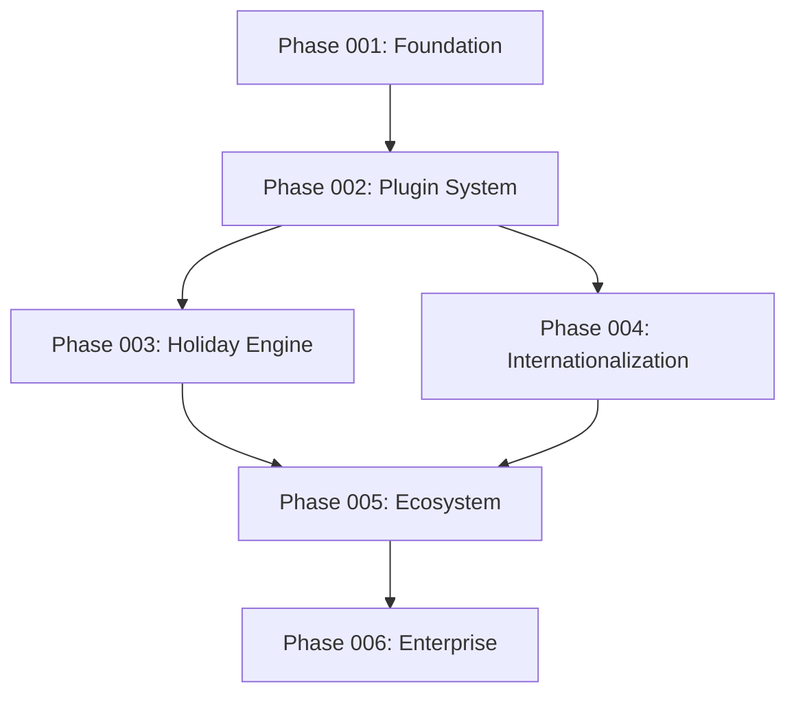

# Kairos Project Roadmap & Task Management

## 📋 Overview

This directory contains the comprehensive project roadmap for Kairos, organized into strategic phases. Each phase contains detailed tasks with specific deliverables, timelines, and dependencies.

## 🗂️ Phase Structure

### Phase 001: Foundation & Core Architecture (2-3 Weeks)
**Focus**: Core performance optimization, memory management, type system enhancement, and development tooling improvements.

### Phase 002: Plugin System Enhancement (3-4 Weeks)
**Focus**: Advanced plugin architecture, development SDK, marketplace infrastructure, and security framework.

### Phase 003: Holiday Engine Advanced Features (4-5 Weeks)
**Focus**: Sophisticated holiday calculations, global database expansion, subscription services, and business calendar customization.

### Phase 004: Internationalization Expansion (3-4 Weeks)
**Focus**: Advanced locale system, translation framework, cultural adaptation, and multiple calendar systems.

### Phase 005: Ecosystem & Community Building (4-6 Weeks)
**Focus**: Community platform, developer resources, integration ecosystem, plugin marketplace, and strategic partnerships.

### Phase 006: Enterprise Features & Advanced Use Cases (5-6 Weeks)
**Focus**: Enterprise security, business intelligence, multi-tenant architecture, workflow automation, and industry solutions.

## 📊 Task Status Summary

| Phase | Status | Tasks | Priority | Duration |
|-------|--------|-------|----------|----------|
| 001 | Planning | 8 tasks | Critical | 2-3 weeks |
| 002 | Planning | 8 tasks | High | 3-4 weeks |
| 003 | Planning | 8 tasks | High | 4-5 weeks |
| 004 | Planning | 8 tasks | High | 3-4 weeks |
| 005 | Planning | 8 tasks | High | 4-6 weeks |
| 006 | Planning | 8 tasks | High | 5-6 weeks |

**Total Project Duration**: 21-28 weeks (5-7 months)

## 🎯 Task Naming Convention

All tasks follow the `T###: Title` format:
- **T001-T008**: Phase 001 - Foundation
- **T009-T016**: Phase 002 - Plugin System
- **T017-T024**: Phase 003 - Holiday Engine
- **T025-T032**: Phase 004 - Internationalization
- **T033-T040**: Phase 005 - Ecosystem
- **T041-T048**: Phase 006 - Enterprise

## 📋 Task Structure

Each task includes:
- **Title**: Clear, descriptive task name
- **Description**: Detailed task objective
- **Details**: Specific implementation requirements
- **Files**: List of files and directories to be created/modified
- **Dependencies**: Prerequisite tasks that must be completed first
- **Estimated Hours**: Time estimate for completion
- **Status**: Current task status (Pending/In Progress/Completed)

## 🔄 Dependencies & Critical Path

Tasks are organized with clear dependencies to ensure logical progression:

## 📈 Success Metrics

Each phase has specific success criteria:

- **Phase 001**: 50% performance improvement, 30% memory reduction
- **Phase 002**: 40% faster plugin loading, comprehensive security
- **Phase 003**: 50+ countries coverage, 99.9% accuracy
- **Phase 004**: 40+ locales, cultural adaptation
- **Phase 005**: 1000+ community members, 100+ plugins
- **Phase 006**: Enterprise compliance, 99.99% uptime

## 🎯 Strategic Objectives

1. **Technical Excellence**: Build a world-class date/time library
2. **Market Leadership**: Become the go-to solution for date/time functionality
3. **Community Growth**: Foster a vibrant developer ecosystem
4. **Enterprise Success**: Serve large-scale business applications
5. **Global Impact**: Support diverse cultural and international needs

## 📝 Guidelines for Task Execution

### Before Starting a Task
1. Review all dependencies and ensure they are completed
2. Read the complete task description and details
3. Set up the development environment as needed
4. Create a feature branch for the task

### During Task Execution
1. Follow the established code quality standards
2. Write comprehensive tests for all new functionality
3. Update documentation as needed
4. Track progress against the estimated hours

### After Task Completion
1. Ensure all tests pass and coverage is maintained
2. Update task status to "Completed"
3. Notify the team of completion
4. Document any learnings or changes

## 🚀 Getting Started

1. **Choose a Phase**: Start with Phase 001 tasks as they provide the foundation
2. **Review Dependencies**: Ensure prerequisite tasks are completed
3. **Estimate Resources**: Allocate appropriate time and team members
4. **Track Progress**: Use the provided status tracking system
5. **Communicate**: Regular updates on progress and blockers

## 📞 Support & Resources

- **Documentation**: Refer to the main project documentation
- **Community**: Engage with the development community
- **Tools**: Use the provided development and testing tools
- **Templates**: Leverage the provided scaffolding templates

---

**Note**: This roadmap is a living document and will be updated based on feedback, market changes, and technical discoveries. Regular reviews and adjustments are expected.